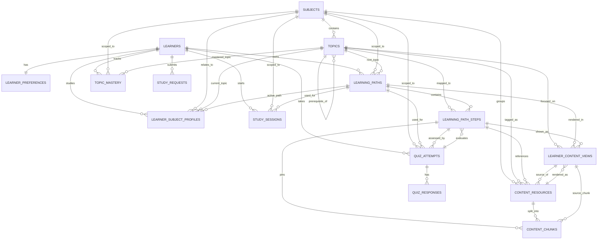

# ER Diagram and Query Flow

This document shows how the main tables and the vector DB fit together.

## ER Diagram

## Meaning of the main relationships

- `learners` is the root user table.
- `learner_preferences` stores one preference row per learner.
- `subjects` is the top-level domain list.
- `topics` defines the prerequisite graph inside a subject.
- `learning_paths` stores one active or historical roadmap.
- `learning_path_steps` stores the ordered steps in that roadmap.
- `content_resources` is the metadata for content stored in the vector DB.
- `content_chunks` are the smaller retrieval units inside the vector DB.
- `learning_path_steps.resource_id` and `learning_path_steps.chunk_id` link roadmap steps to exact content.
- `quiz_attempts` stores each quiz session.
- `quiz_responses` stores each answer.
- `topic_mastery` stores per-topic mastery estimates.
- `study_sessions` stores when the learner studied.
- `study_requests` stores user-entered topics from the dashboard.
- `learner_content_views` is an optional cached personalized rendering layer.

## Dashboard Query Flow

When the learner opens the app again, the dashboard should load data in this order:

### 1. Find the learner

Query `learners` by email.

Needed fields:

- `learner_id`
- `full_name`
- `email`
- `preferred_language`

### 2. Load preferences

Query `learner_preferences` by `learner_id`.

Needed fields:

- `content_format`
- `explanation_style`
- `quiz_style`
- `learning_pace`
- `session_length`
- `feedback_style`
- `accessibility_notes`

### 3. Load current subject state

Query `learner_subject_profiles` by `learner_id`.

Needed fields:

- `subject_id`
- `active_path_id`
- `current_topic_id`
- `goal_type`
- `current_level`
- `status`
- `path_completion_pct`
- `completed_step_count`
- `total_step_count`
- `mastery_score`
- `confidence_score`
- `next_review_at`

### 4. Load current roadmap

Query `learning_paths` using `active_path_id`.

Needed fields:

- `path_title`
- `path_status`
- `target_outcome`
- `total_steps`
- `completed_steps`
- `last_accessed_at`

### 5. Load roadmap steps

Query `learning_path_steps` by `path_id`, ordered by `step_order`.

Needed fields:

- `step_title`
- `step_description`
- `step_status`
- `estimated_minutes`
- `actual_minutes`
- `resource_id`
- `chunk_id`
- `content_version`
- `topic_id`

This gives:

- completed steps
- current step
- pending steps

### 6. Load mastery and review state

Query `topic_mastery` by `learner_id` and `subject_id`.

Needed fields:

- `topic_id`
- `mastery_probability`
- `review_due_at`
- `mastery_status`

This gives:

- weak topics
- review schedule
- mastery trends

### 7. Load latest quiz state

Query `quiz_attempts` for the latest attempt by learner and subject.

Needed fields:

- `score`
- `quiz_type`
- `completion_status`
- `difficulty_level`
- `completed_at`

Then query `quiz_responses` for that attempt if you want the detailed answers.

### 8. Load content for the next step

Use the current step’s `resource_id`, `chunk_id`, and `content_version` to fetch the same content again.

The vector DB should return:

- the best content chunks
- related examples
- supporting definitions
- retrieval scores

If a cached personalized view exists in `learner_content_views`, use that first.

## Recommended Dashboard Sections

The dashboard can safely show:

- learner profile
- current subject
- active roadmap
- progress bar
- next step
- last quiz result
- topics to review
- recent study sessions

