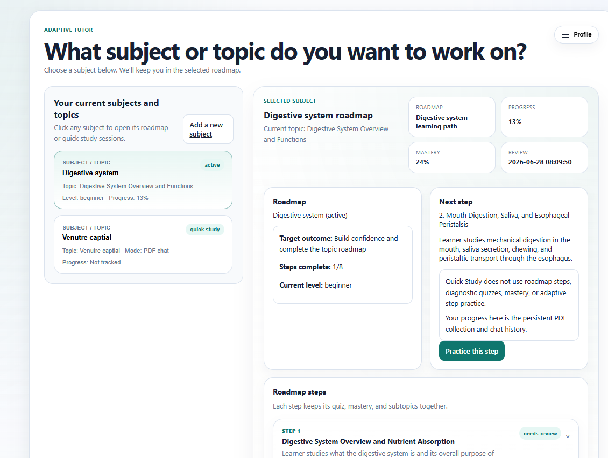
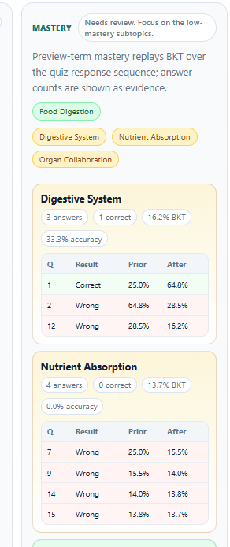
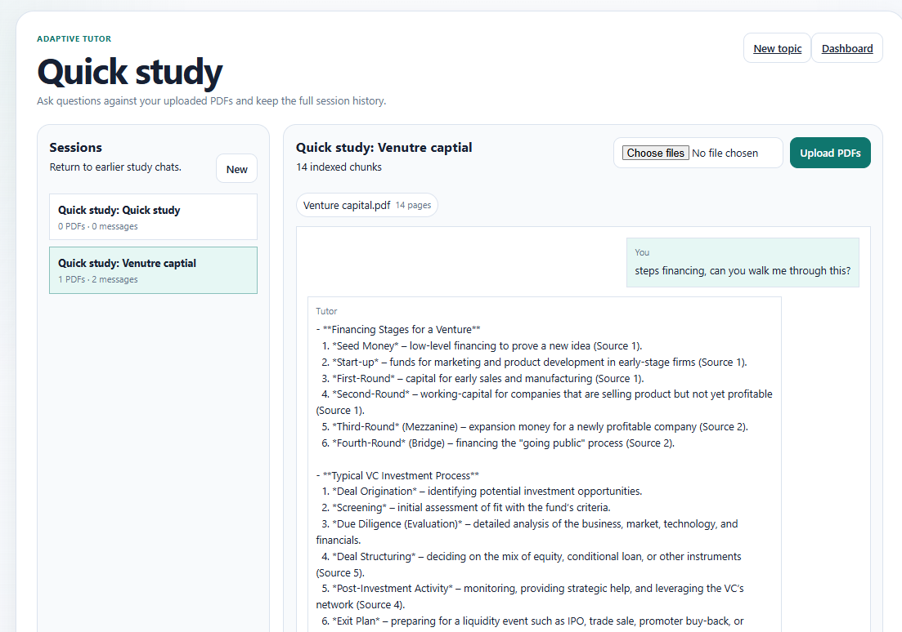
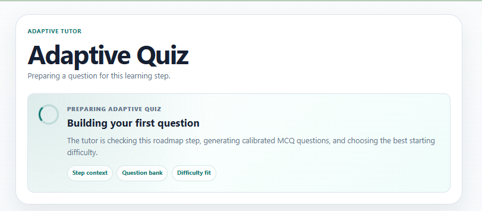
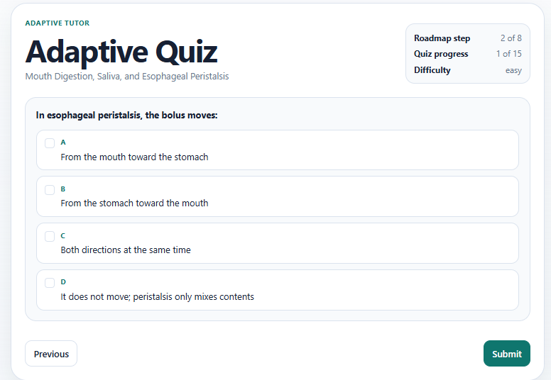

# 📚 Adaptive Tutor

Adaptive Tutor is a local learning app with two study modes:

- **Create roadmap**: confirms the topic, runs a diagnostic quiz, builds a personalized roadmap, and advances through adaptive quizzes.
- **Quick study**: creates a persistent PDF-based RAG chat where learners upload PDFs, ask questions, view cited snippets, and return to the same chat later.

The app uses a Python backend, SQLite persistence, static frontend pages, Groq for LLM generation, SerpApi for topic grounding, and MiniLM sentence-transformer embeddings for quick-study PDF retrieval.

## Screenshots

### Dashboard With Roadmap And Quick Study



### Mastery Breakdown



### Quick Study PDF Chat



### Adaptive Quiz Loading



### Adaptive Quiz Question



## Project Structure

```text
.
+-- agents/
|   +-- adaptive_quiz.py
|   +-- content_service.py
|   +-- knowledge_assessment.py
|   +-- learning_path.py
|   +-- mastery_tracking.py
|   +-- quick_study_chat.py
+-- backend/
|   +-- app.py
|   +-- adaptive_tutor_v2.db
+-- data/
|   +-- sql/
|       +-- user_profile_schema.sql
+-- docs/
|   +-- images/
+-- frontend/
|   +-- index.html
|   +-- onboarding_profile_form.html
|   +-- dashboard.html
|   +-- subject_topic_entry.html
|   +-- diagnostic_quiz.html
|   +-- adaptive_quiz.html
|   +-- quick_study.html
|   +-- app/
+-- scripts/
```

## Environment Variables

Create a `.env` file in the project root:

```env
GROQ_API_KEY="your_groq_api_key"
GROQ_MODEL="llama-3.3-70b-versatile"
SERP_API_KEY="your_serpapi_key"
```

The backend also accepts these SerpApi variable names:

```env
SERPAPI_API_KEY="your_serpapi_key"
SERPAPI_KEY="your_serpapi_key"
```

Do not commit real API keys.

## How To Run The App

Open two terminals from the project root.

### 1. Start The Backend

Recommended on Windows:

```powershell
.\venv\Scripts\python.exe backend\app.py
```

Or activate the virtual environment first:

```powershell
.\venv\Scripts\Activate.ps1
python backend\app.py
```

The backend runs at:

```text
http://localhost:8001
```

It initializes or migrates the SQLite database at:

```text
backend/adaptive_tutor_v2.db
```

### 2. Start The Frontend

In a second terminal:

```powershell
python -m http.server 8000
```

Open:

```text
http://localhost:8000/frontend/index.html
```

## User Flow

### Login And Onboarding

1. Open `frontend/index.html`.
2. Enter an email.
3. Existing learners go to the dashboard.
4. New learners complete onboarding first.

### Create Roadmap Mode

1. From the dashboard, choose **Add a new subject**.
2. Enter a topic.
3. Confirm the grounded topic meaning.
4. Take the diagnostic quiz.
5. The app creates a roadmap.
6. Use **Practice this step** to start adaptive quizzes.
7. Completed quizzes update progress, mastery, and the next roadmap step.

### Quick Study Mode

1. From **Add a new subject**, choose **Quick study**.
2. Confirm the topic.
3. The app opens `quick_study.html`.
4. Upload one or more PDFs.
5. Ask questions about the uploaded documents.
6. The assistant answers using retrieved PDF chunks and shows source snippets.
7. Follow-up question chips are generated after each answer.
8. Sessions, uploaded documents, chunks, and chat history are persistent.

To reopen a Quick Study chat:

1. Go to the dashboard.
2. Click the quick-study subject.
3. Click **Resume quick study**.

Quick Study does not use roadmap progress, mastery, diagnostic quizzes, or adaptive step practice. Its persistent state is the PDF collection and chat history.

## Core Backend Endpoints

### Learner And Dashboard

```text
POST /api/onboarding
GET  /api/learner
GET  /api/dashboard
```

### Topic Grounding And Study Requests

```text
POST /api/topic/ground
POST /api/topic
POST /api/diagnostic/submit
```

### Adaptive Quiz

```text
POST /api/adaptive-quiz/start
POST /api/adaptive-quiz/answer
POST /api/mastery/update
```

### Quick Study

```text
GET  /api/quick-study/sessions
GET  /api/quick-study/session
POST /api/quick-study/session
POST /api/quick-study/upload
POST /api/quick-study/chat
```

## Data Persistence

The app uses SQLite for learner state, roadmaps, quizzes, mastery, and quick-study chat state.

Important quick-study tables:

- `quick_study_sessions`
- `quick_study_documents`
- `quick_study_chunks`
- `quick_study_messages`

Important roadmap/adaptive quiz tables:

- `learners`
- `learner_preferences`
- `subjects`
- `topics`
- `learner_subject_profiles`
- `learning_paths`
- `learning_path_steps`
- `quiz_attempts`
- `quiz_responses`
- `topic_mastery`

## Notes

- Use `.\venv\Scripts\python.exe backend\app.py` if `py backend/app.py` uses the wrong Python environment.
- The first Quick Study PDF indexing step may be slower because the MiniLM embedding model loads lazily.
- SerpApi grounding uses web result metadata and selected source text to keep topics like MCP servers or GraphRAG aligned with the intended domain.
- If an old roadmap or quick-study session looks stale, create a new topic/session so the latest generation logic is used.
